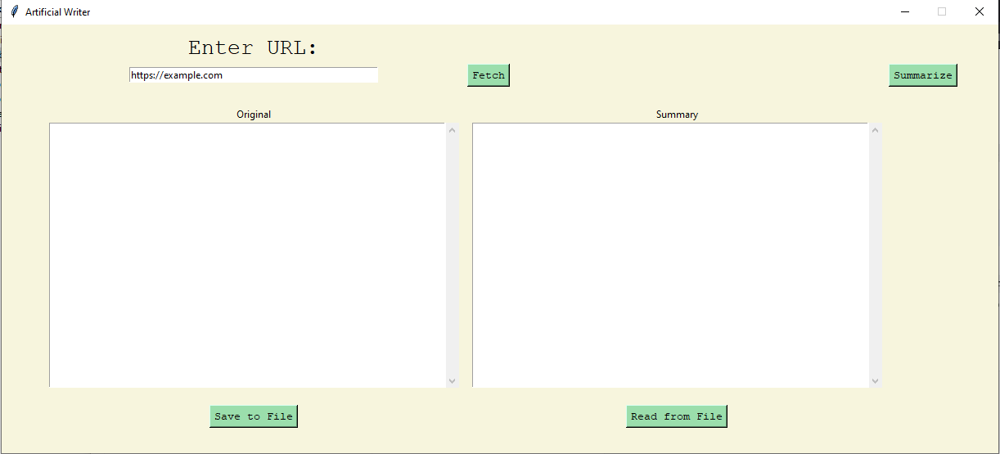

<<<<<<< HEAD
# Artificial Writer




## Overview

The **Artificial Writer** is a Python application that fetches text 
from a specified URL, processes it, and generates new text fragments. 
The generated text is structured and coherent, making it suitable for 
various applications such as creative writing, content generation, and more. 
The application features a simple graphical user interface (GUI) built with Tkinter.

## Features

- Fetch text from any valid URL.
- Generate new text fragments based on the fetched content.
- Save generated text to a file and read from it.
- User-friendly GUI for easy interaction.


## Requirements

- Python 3.x
- `requests` library
- `beautifulsoup4` library
- `openai` library
- `tkinter` GUI library (pre-installed with Python)
- `os` system library(pre-installed with Python)
- You need openai api keys. Modify the writer.py accordingly
## Installation

1. Clone the repository or download the source code.
2. Install the required libraries using pip:

   ```bash
   pip install requests beautifulsoup4 openai
   
=======
# artificial_writer
AI writer school semester project
>>>>>>> origin/main
