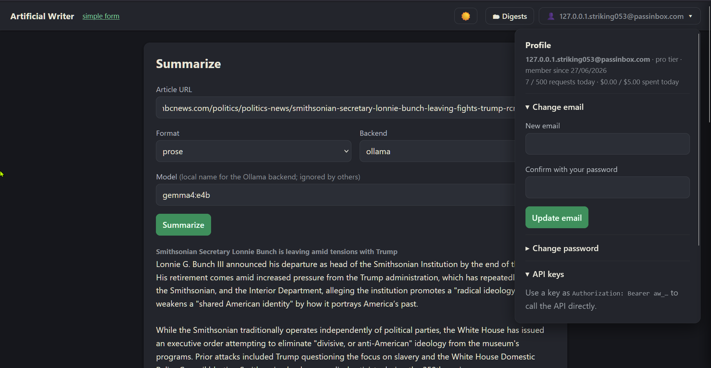
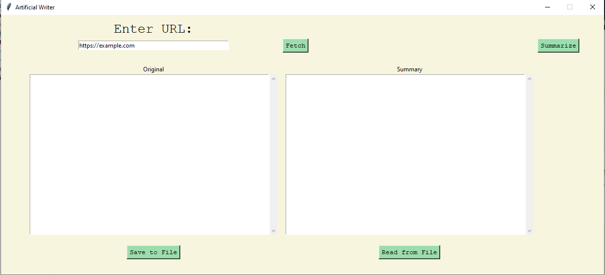

# Artificial Writer



Fetch an article from a URL, extract its readable text, and summarize it — from a
command line, a desktop GUI, or a web app. Summarizer backends are pluggable, and
the default one runs offline with no API key.

> Originally a school project, rebuilt as a tested, typed, multi-interface
> application.

---

## Highlights

- Extractive summarization offline by default; [Ollama](https://ollama.com) for a
  free local LLM; OpenAI and Anthropic behind their own API keys.
- Three front-ends — CLI, Tkinter desktop, FastAPI web — over one shared pipeline.
- HTML articles, PDFs, and YouTube transcripts, dispatched by URL.
- Six output formats: prose, TL;DR, bullets, quotes, tweet, LinkedIn.
- A multi-tenant service layer on Postgres and Redis: sessions and API keys,
  per-user archives with full-text search, tier quotas, batch jobs, RSS polling.
- Typed (`mypy`), linted (`ruff`), tested with `pytest` against mocked network,
  CI on Python 3.10–3.13.

## Architecture

```
URL ──▶ TextFetcher ──▶ clean text ──▶ Summarizer ──▶ summary ──▶ Storage
                                          ▲
                 extractive · ollama · openai · anthropic  (chosen by a factory)
```

The three front-ends are separate, co-equal packages — `cli/`, `gui/`, and `web/` —
each a thin wrapper around the shared engine in
[`core/`](src/artificial_writer/core). A front-end depends on `core` and never on
another front-end, so behavior stays consistent and the interfaces stay small.

```
run_cli.py · run_gui.py · run_web.py   # top-level launchers for each front-end
src/artificial_writer/
├── core/                    # the shared engine every front-end is built on
│   ├── config.py            #   typed settings from env / .env (pydantic-settings)
│   ├── pipeline.py          #   fetch → summarize → store orchestration
│   ├── storage.py           #   save/read results
│   ├── output_format.py     #   prose / tldr / bullets / quotes / tweet / linkedin
│   ├── errors.py            #   domain error hierarchy
│   ├── fetchers/            #   source → cleaned article text, by URL type
│   │   ├── base.py          #     Fetcher ABC + FetchedArticle
│   │   ├── registry.py      #     URL-based dispatch to a fetcher
│   │   ├── html.py          #     articles (default)
│   │   ├── pdf.py           #     PDF documents        [pdf extra]
│   │   └── youtube.py       #     video transcripts    [youtube extra]
│   └── summarizers/         #   pluggable backends + factory
│       ├── base.py          #     Summarizer ABC + SummaryResult
│       ├── factory.py       #     builds the configured backend
│       ├── prompt.py        #     shared prompt construction
│       ├── pricing.py       #     per-model token costs, for quota accounting
│       ├── extractive.py    #     free, offline (default)
│       ├── ollama.py        #     free, local LLM
│       ├── openai_provider.py
│       └── anthropic_provider.py
├── service/                 # multi-tenant layer: auth, quotas, archive, jobs
│   ├── db.py                #   async engine + session lifecycle
│   ├── models.py            #   SQLAlchemy tables
│   ├── schemas.py           #   request/response models
│   ├── repository.py        #   per-user persistence + full-text search
│   ├── auth.py              #   sessions, password hashing, API keys
│   ├── quotas.py            #   tier policy: backend gating + daily caps
│   ├── summarize_service.py #   pipeline call wrapped in quota + archive logic
│   ├── digests.py           #   grouped multi-article results
│   ├── feeds.py             #   RSS subscriptions
│   └── jobs/                #   RQ queue, batch tasks, feed scheduler
├── cli/                     # command-line front-end
├── gui/                     # Tkinter desktop front-end
└── web/                     # FastAPI app
    ├── app.py               #   form UI, browser console, health, /api/fetch
    ├── routers/             #   auth, summarize, batch, feeds, digests
    └── templates/           #   Jinja templates
```

Tests mirror that layout:

```
tests/
├── conftest.py          # shared fixtures (DB engines, TestClients, settings)
├── samples.py           # sample article inputs
├── unit/                # core engine + CLI, no I/O (network mocked)
├── service/             # auth, quotas, repository, background jobs
├── web/                 # HTTP routes and auth flows
└── e2e/                 # full register → summarize → archive flow
```

## Installation

```bash
git clone https://github.com/TymFly/artificial_writer.git
cd artificial_writer
python -m venv .venv
source .venv/bin/activate          # Windows: .venv\Scripts\Activate.ps1
```

Then pick the extras you need:

```bash
pip install -e .                # core (CLI + GUI, free extractive summarizer)
pip install -e ".[web]"         # + web app
pip install -e ".[all,dev]"     # everything + dev tools (tests, lint, types)
```

## Usage

### CLI

```bash
artwriter https://en.wikipedia.org/wiki/Solar_power
artwriter https://example.com/article --sentences 3
artwriter https://example.com/article --summarizer ollama --save
artwriter https://example.com/article --json
```

Also available as `python -m artificial_writer <url>`, or `python run_cli.py <url>`
from a source checkout.

### Desktop GUI

```bash
artwriter-gui                        # installed console script
python -m artificial_writer.gui      # or: python run_gui.py
```

Enter a URL and click **Fetch** to pull and view the original article text, then
pick a backend and click **Summarize**.



### Web app

```bash
artwriter-web                        # installed console script (needs [web] extra)
python -m artificial_writer.web      # or: python run_web.py
```

Two pages are served on http://127.0.0.1:8000:

- `/` — a form that fetches an article, then summarizes it with a chosen backend
  (and, for Ollama, a local model name). No account needed, free backends only.
- `/app` — the signed-in console pictured at the top, which drives the JSON API from
  the browser: summarize, search the archive, read digests, manage the account and
  API keys.

The unauthenticated JSON endpoint mirrors the form:

```bash
# fetch only — clean the article text without summarizing
curl -X POST http://127.0.0.1:8000/api/fetch \
     -H "Content-Type: application/json" \
     -d '{"url": "https://example.com/article"}'
```

## Multi-tenant web service

The same FastAPI app exposes an authenticated, multi-tenant API backed by
PostgreSQL (per-user archives + full-text search) and Redis (async batch jobs and
RSS feed polling). The bundled compose stack runs the whole thing:

```bash
cp .env.example .env                 # set AW_SESSION_SECRET (and any API keys)
docker compose -f infra/docker-compose.yml up --build
```

That starts five services: **postgres**, **redis**, **api** (on
http://127.0.0.1:8000), **worker** (RQ batch/feed jobs), and **scheduler**
(periodic feed polling). The `api` container runs `alembic upgrade head` on start
via [`infra/entrypoint.sh`](infra/entrypoint.sh), so the schema is always current.

Two unauthenticated health endpoints:

```bash
curl http://127.0.0.1:8000/health        # liveness: the process is up
curl http://127.0.0.1:8000/health/ready  # readiness: pings the DB; 503 if unreachable
```

The compose healthcheck gates `worker` and `scheduler` on `/health/ready`, so they
never start against a dead or unmigrated database. If the database goes down,
authenticated endpoints return 503 with an actionable message rather than an empty
500.

**Register a user, then authenticate with either a cookie or an API key:**

```bash
# register (sets the aw_session cookie) and keep cookies in a jar
curl -c jar.txt -X POST http://127.0.0.1:8000/auth/register \
     -H "Content-Type: application/json" \
     -d '{"email": "me@example.com", "password": "password123"}'

# issue a long-lived API key (the full secret is shown exactly once)
curl -b jar.txt -X POST http://127.0.0.1:8000/auth/keys      # -> {"key": "aw_..."}

# summarize for that user (Bearer key OR the cookie jar authenticates)
curl -X POST http://127.0.0.1:8000/api/summarize \
     -H "Authorization: Bearer aw_..." -H "Content-Type: application/json" \
     -d '{"url": "https://example.com/article", "output_format": "bullets"}'
```

Authenticated endpoints, all scoped to the calling user:

| Method & path | Purpose |
| --- | --- |
| `POST /auth/register` · `POST /auth/login` · `POST /auth/logout` | Session (cookie) auth |
| `GET /auth/me` | Profile, tier, and today's usage against the caps |
| `POST /auth/email` · `POST /auth/password` · `DELETE /auth/account` | Account management (each confirmed with the current password) |
| `POST /auth/keys` · `GET /auth/keys` · `DELETE /auth/keys/{id}` | Issue / list / revoke API keys |
| `POST /api/summarize` | Fetch + summarize one URL, stored to the user's archive |
| `GET /api/archive?q=` | Full-text search the user's stored summaries |
| `POST /api/batch` · `GET /api/batch/{job_id}` | Summarize many URLs into one digest (async) |
| `POST /api/feeds` · `GET /api/feeds` · `DELETE /api/feeds/{id}` | Manage polled RSS feeds |
| `GET /api/digests` · `GET /api/digests/{id}` · `DELETE /api/digests/{id}` | View and remove batch/feed digests (JSON or HTML) |

Tier policy gates the paid backends: a free tier may use only the offline/free
backends (a paid backend returns 403) and is bounded by a daily request cap (429
over cap); a pro tier unlocks OpenAI and Anthropic up to a daily request and USD
cost ceiling. See the `AW_*` tier vars in [`.env.example`](.env.example).

None of this touches the CLI or desktop GUI — they need no `server` dependencies
and never reach Postgres or Redis.

## Configuration

All settings are optional and read from environment variables or a `.env` file
(`AW_` prefix). Copy [`.env.example`](.env.example) to `.env` to customize.

| Variable | Default | Description |
| --- | --- | --- |
| `AW_SUMMARIZER` | `extractive` | `extractive` \| `ollama` \| `openai` \| `anthropic` |
| `AW_EXTRACTIVE_SENTENCES` | `5` | Sentences kept by the extractive summarizer |
| `AW_MAX_INPUT_CHARS` | `80000` | Global upper bound (characters) fed to the summarizer; cut back to the last full stop |
| `AW_OLLAMA_MAX_INPUT_TOKENS` | `8000` | Per-backend input cap for Ollama (estimated tokens, under the global cap) |
| `AW_OPENAI_MAX_INPUT_TOKENS` | `12000` | Per-backend input cap for OpenAI (estimated tokens, under the global cap) |
| `AW_ANTHROPIC_MAX_INPUT_TOKENS` | `24000` | Per-backend input cap for Anthropic (estimated tokens, under the global cap) |
| `AW_OLLAMA_MODEL` | `llama3.2` | Local model name for Ollama |
| `AW_OPENAI_API_KEY` | – | Enables the OpenAI backend |
| `AW_ANTHROPIC_API_KEY` | – | Enables the Anthropic backend |

The multi-tenant web service adds a few more (see [`.env.example`](.env.example)):

| Variable | Default | Description |
| --- | --- | --- |
| `AW_DATABASE_URL` | `postgresql+asyncpg://aw:aw@localhost:5432/aw` | Async Postgres URL (Alembic converts it to a sync driver) |
| `AW_REDIS_URL` | `redis://localhost:6379/0` | RQ broker + result store for batch jobs / feeds |
| `AW_SESSION_SECRET` | `change-me` | Signs the `aw_session` login cookie — change it in any deploy |
| `AW_DEFAULT_TIER` | `free` | Tier assigned to new users |
| `AW_FREE_BACKENDS` / `AW_PAID_BACKENDS` | `["extractive","ollama"]` / `["openai","anthropic"]` | Which backends each class of tier may use |
| `AW_TIER_DAILY_REQUEST_CAP` | `{"free": 20, "pro": 500}` | Per-tier daily request caps (429 over cap) |
| `AW_TIER_DAILY_COST_CAP_USD` | `{"free": 0.0, "pro": 5.0}` | Per-tier daily USD cost caps (a `0` cap blocks paid backends, 403) |

### Using a free local LLM (Ollama)

```bash
# install Ollama from https://ollama.com, then:
ollama pull llama3.2
AW_SUMMARIZER=ollama artwriter https://example.com/article
```

## Development

```bash
pip install -e ".[all,dev]"
pytest            # run the test suite (network is mocked)
ruff check .      # lint
mypy              # type-check
```

`pyproject.toml` is the single source of truth for dependencies — pick the extras
you need (`web`, `server`, `openai`, `anthropic`, `pdf`, `youtube`, `all`, `dev`)
rather than a `requirements.txt`. Test subsets run by directory:

```bash
pytest tests/unit         # fast: core engine + CLI, no DB
pytest tests/service      # service layer against SQLite
pytest tests/web          # HTTP routes
pytest tests/e2e          # full flow (Postgres via testcontainers; skips without Docker)
```

## License

[MIT](LICENSE)
